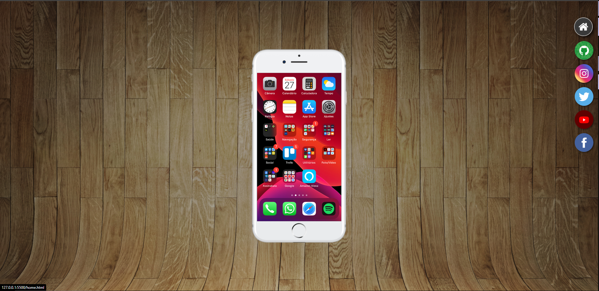

# Celular Virtua
<h1 align="center">Celular Virtual</h1>

Projeto feito com base no curso de HTML e CSS do canal Curso em Video  

  <a href="#-tecnologias">Tecnologias</a>&nbsp;&nbsp;&nbsp;|&nbsp;&nbsp;&nbsp;
  <a href="#-projeto">Projeto</a>&nbsp;&nbsp;&nbsp;|&nbsp;&nbsp;&nbsp;
  <a href="#memo-licença">Licença</a>

  

 

  

## 🚀 Tecnologias

Esse projeto foi desenvolvido com as seguintes tecnologias:

- HTML e CSS
- Github
- Figma

## 💻 Projeto

O celular virtual foi feito para trazer a prática os conceitos do desenvolvimento WEB

- [Visite o projeto online](https://helenapl145.github.io/projeto-social/)
## :memo: Licença

Esse projeto está sob a licença MIT.

---

Feito com ♥ by Helena Lima

